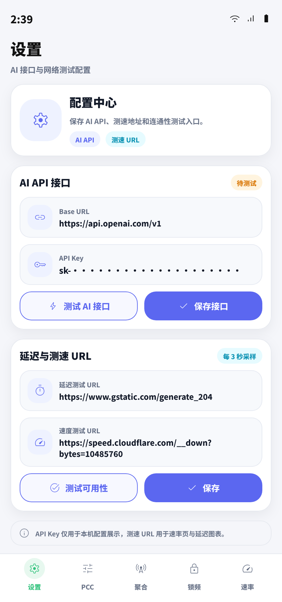
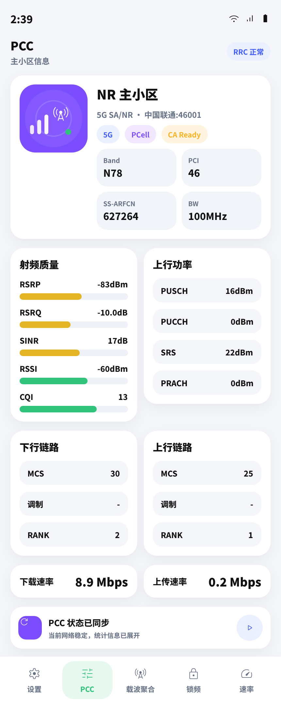
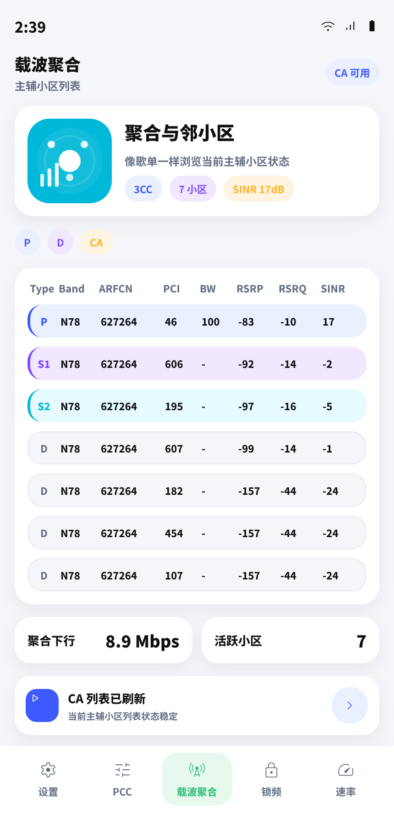
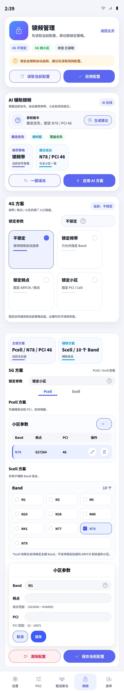
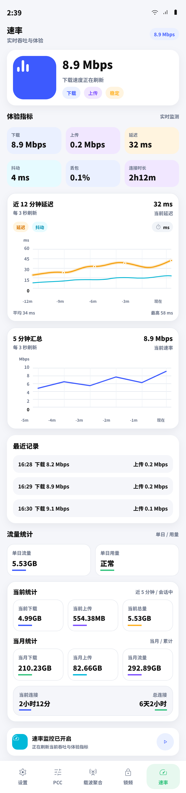

# Brovi Huawei 5G CPE Manager

一款基于 Kotlin + Jetpack Compose 的 Android 应用，用来管理华为 / Brovi 5G CPE。
应用通过设备 WebUI 的 XML API 直接读取和控制路由器状态，支持主小区信息、载波聚合、锁频、测速、系统日志和 Telnet / AT 调试。

## 核心功能

- 连接与登录
  - 可配置 Base URL、用户名和密码
  - 支持自动登录、记住密码、自动重登、自动刷新和刷新间隔
  - 应用切到后台时会暂停轮询，回到前台后恢复
- PCC 主面板
  - 查看主小区、频段、PCI、ARFCN、带宽、RAT、运营商、PLMN 状态
  - 展示 RSRP / RSRQ / SINR / RSSI / CQI、上下行速率、AMBR、QCI、速度限制状态
  - 支持流量开关，并可进入系统日志和 AT 调试
- 载波聚合
  - 展示主载波、辅载波和邻区信息
  - 尽量兼容不同固件返回的 XML 字段
- 锁频管理
  - 支持网络模式切换、频段锁定、频点 / 小区锁定
  - 支持清除锁频配置
  - 显示当前锁频参数和辅助信息
- 速率与质量
  - 查看当前下载 / 上传速率、延迟、抖动、丢包率
  - 支持自定义测速和延迟测试 URL
  - 记录趋势图，便于观察变化
- 系统日志
  - 从 `/api/log/loginfo` 拉取系统操作日志
  - 支持按类型和级别筛选
- 高级调试
  - 尝试启用 Telnet 调试端口 `20249`
  - 支持发送原始 AT 命令并查看回包
  - 可读取 Telnet 中的 AMBR / QCI 信息
- 数据持久化
  - 使用 DataStore 保存常用配置

## 界面预览

<table>
  <tr>
    <td></td>
    <td></td>
  </tr>
  <tr>
    <td></td>
    <td></td>
  </tr>
  <tr>
    <td></td>
    <td></td>
  </tr>
</table>

## 环境要求

- Android 6.0 及以上，`minSdk = 23`
- Android Studio / JDK 17+
- 手机需要和 CPE 处于同一局域网
- 默认设备地址是 `http://10.0.0.1`
- 设备固件需要暴露华为 WebUI XML API
- 由于使用的是 HTTP 接口，应用已开启明文流量

## 快速开始

1. 连接到 CPE 所在网络。
2. 用 Android Studio 打开项目并等待 Gradle 同步完成。
3. 在「设置」页填写 Base URL、用户名和密码。
4. 按需开启自动登录、自动刷新和记住密码。
5. 切换到底部标签页查看 PCC、载波聚合、锁频、速率和日志。
6. 在支持的设备上，可以使用「AT 调试」进行 Telnet 原始命令测试。

## 构建

```bash
./gradlew assembleDebug
```

Windows：

```powershell
gradlew.bat assembleDebug
```

## 项目结构

| 文件 | 说明 |
| --- | --- |
| `app/src/main/java/com/cpemanager/MainActivity.kt` | Compose UI、底部导航和各功能页面 |
| `app/src/main/java/com/cpemanager/viewmodel/CpeViewModel.kt` | 页面状态、自动刷新、登录和 Telnet 监控 |
| `app/src/main/java/com/cpemanager/data/repository/CpeRepository.kt` | CPE API 调用与数据解析 |
| `app/src/main/java/com/cpemanager/network/RetrofitClient.kt` | `HuaweiCpeClient` 网络客户端入口 |
| `app/src/main/java/com/cpemanager/data/local/SettingsRepository.kt` | DataStore 设置持久化 |
| `design-*.png` | 页面设计预览图 |
| `pencil-new.pen` | 设计稿源文件 |

## 注意事项

- 不同固件返回的 XML 字段可能不一致，部分指标为空属于正常情况。
- 锁频、锁小区和 AT 调试属于高级操作，修改前请确认参数。
- Telnet / 开发者模式功能是否可用，取决于设备型号与固件。
- 如果你用的是非默认地址，请在设置页改成实际的 CPE IP。

## 许可证

仓库当前未声明许可证，如需开源分发请补充许可证文件。
